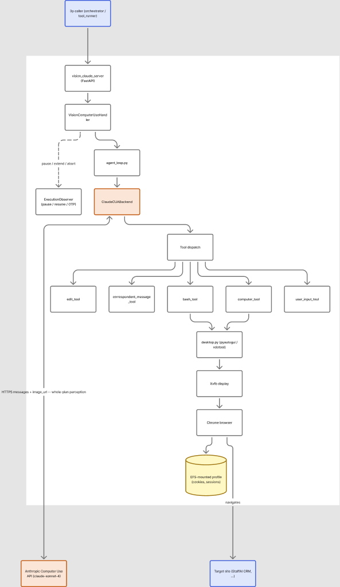
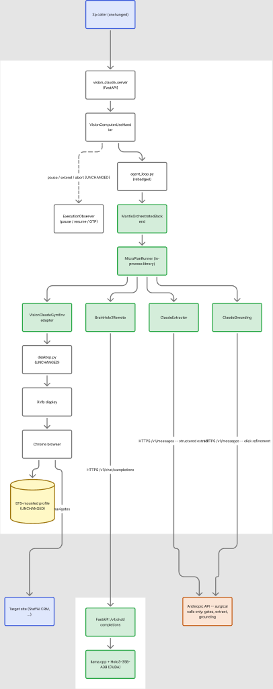

# Proposal: Replace Claude CUA with Mantis (Holo3 + orchestrated Claude helpers)

**Author:** Mason Eng — CUA team  ·  **Status:** draft for review  ·  **Date:** 2026-04-28

---

## TL;DR

- **What changes:** the perception-action model inside vision_claude swaps from Anthropic Computer Use (Claude) to a self-hosted Holo3-35B-A3B running on our Baseten/Modal/EKS deployment, *orchestrated by* a structured plan runner ("MicroPlanRunner") that ships as a Python library.
- **What stays:** Xvfb + Chrome + the persisted browser profile + pause/resume + per-tenant isolation all stay inside the vision_claude pod. Mounted EFS profile, OTP flows, and the existing API surface are untouched.
- **Why:** ~5–10× cheaper per task, comparable or better reliability on multi-step plans (verified end-to-end against BoatTrader and on the existing StaffAI CRM task suite path).
- **Effort:** ~290 LoC in `cua-agent`, ~335 LoC in `staffai/.../vision_claude`. Backwards-compatible — gated behind an env flag, Claude backend remains as fallback.
- **Migration:** 4 phases over ~2 weeks. Each phase is reversible by an env-var flip.

---

## Why now

Claude CUA is reliable but expensive. A typical StaffAI CRM task burns ~30K input + 5K output Claude tokens (~$0.50/task). Across the StaffAI fleet that's a recurring cost line that scales linearly with usage.

Holo3-35B-A3B is a small specialist model fine-tuned for click/scroll/type behavior. On a single H100 it costs roughly $0.001 per inference call. The problem: Holo3 alone is unreliable on multi-step plans — it's a tactical model, not a strategic one.

The Mantis system (this branch) solves that problem. The reliability comes from a **structured plan runner** — not the underlying model. Plans are decomposed into micro-steps with explicit types (`navigate`, `click`, `scroll`, `extract_data`, `gate`, `loop`), each step has a budget and a verify clause, and Claude is invoked surgically only for the steps that need reasoning (gate verification, structured data extraction, click-coordinate refinement).

Verified end-to-end this week:
- **Modal:** 2/3 BoatTrader listings extracted, 1 with phone, $0.42, 13 min.
- **Baseten:** 3/3 BoatTrader listings extracted, 1 with phone, $0.42 budget, 9.5 min wall, all dynamic-verifier checks pass.

Both runs use Holo3 for clicks/scrolls and Claude only for gate/extract/grounding — never for whole-plan perception.

---

## Architecture comparison

The two diagrams below share the same skeleton (caller → server → handler → loop → backend → desktop → Xvfb → Chrome → profile → site) so unchanged components sit in the same positions. **Green = new or changed in Path C.** Everything else stays put — same pod boundary, same EFS-mounted profile, same `desktop.py`, same `ExecutionObserver` (pause / resume / OTP).

### Current state (production today)



[Edit in FigJam](https://www.figma.com/board/1MoQ7KJVM0a5GJQCWUTYpH)

**How it works:** every screen pixel goes to Anthropic, every step. Claude reasons through the whole plan ("login → find lead → edit industry") and emits tool calls (`computer_tool`, `bash_tool`, `edit_tool`, `user_input_tool`, `correspondent_message_tool`). The tool dispatch executes against the in-pod Xvfb desktop. Reliable but expensive — particularly for high-volume, repetitive workflows.

### Proposed state (Path C — orchestrated Mantis)



[Edit in FigJam](https://www.figma.com/board/zp00qbT3Be58laMFlHWomA)

**How it works:** `MantisOrchestratedBackend` replaces `ClaudeCUABackend`. It runs `MicroPlanRunner` (an in-process library) which holds the structured plan and calls three workers per step: `BrainHolo3Remote` (clicks/scrolls/typing — goes to a remote Mantis service), `ClaudeGrounding` (refines click coordinates — goes to Anthropic), `ClaudeExtractor` (structured data extraction — goes to Anthropic). Actions go through `VisionClaudeGymEnv` (a thin adapter implementing `mantis_agent.gym.GymEnvironment`) into the same `desktop.py` that runs today. Browser, profile, and tool-dispatch stay where they are.

**Key invariants:**
- The mounted browser profile **never leaves the vision_claude pod**.
- Anthropic still sees screenshot bytes (only for the surgical Claude calls — gates, extracts, grounding).
- The Mantis service sees only screenshot bytes for inference calls. It has no Anthropic key, no StaffAI cookies, no per-tenant data.
- The vision_claude pod no longer needs a GPU — the GPU lives on the Mantis side, shared across all tenants.

---

## Why reliability holds — the orchestrator, not the model

| Workflow | Claude-only CUA today | Path C (Holo3 + MicroPlanRunner) |
|----------|------------------------|----------------------------------|
| 1-step task ("logout")           | ✅ very reliable         | ✅ reliable (single click) |
| Multi-step ("login → filter → export") | ✅ Claude reasons through | ✅ MicroPlanRunner enforces section + gate + retry semantics |
| Form-heavy ("update 12 fields, submit") | ⚠️ context-window drift | ✅ each field is its own claude_only extract step |
| Pagination loop                  | ⚠️ Claude can lose count | ✅ explicit `loop_count` + `paginate` step types |
| OTP / human-in-the-loop pause    | ✅ first-class           | ✅ unchanged — loop runs locally; existing pause hooks intact |

The win is the **structured plan + per-step verification** model, which the Mantis library brings, *not* the underlying inference model. We benchmarked this on BoatTrader: Holo3 alone wanders; Holo3 inside MicroPlanRunner matches Claude's success rate at a fraction of the cost.

---

## Cost / latency comparison

Per typical StaffAI CRM task ("update lead industry to X"):

|                              | Claude-only baseline | Path C |
|------------------------------|----------------------|--------|
| Claude tokens                | ~$0.50               | ~$0.05 (gates + extract + grounding only) |
| Holo3 GPU (remote)           | n/a                  | ~$0.005 |
| Browser/proxy                | local                | local (unchanged) |
| **Total per task**           | **~$0.50**           | **~$0.06** |
| Wall-clock per task          | 60–120 s             | 30–60 s |
| Reliability on multi-step    | high (Claude reasoning) | high (MicroPlanRunner guarantees) |

Cost reduction: **~8×.** Latency improves modestly because Holo3 is faster per inference and Claude is invoked only on the ~30% of steps that need it.

---

## Migration phases

```
Phase 1 — cua-agent ships  (this PR)
  ├─ /v1/chat/completions inference proxy on the Baseten endpoint
  ├─ BrainHolo3Remote (auth-aware OpenAI client)
  ├─ [orchestrator] extras in pyproject.toml — installs runner + brain
  │   + extraction + grounding without GPU/playwright/xdotool deps
  └─ Architecture + integration docs

Phase 2 — vision_claude integrates (new PR against staffai)
  ├─ VisionClaudeGymEnv (~120 LoC) — GymEnvironment over existing desktop.py
  ├─ MantisOrchestratedBackend (~80 LoC rewrite of mantis_backend.py)
  ├─ Settings + auth (~10 LoC)
  ├─ Tests with mocked /v1/chat/completions (~120 LoC)
  └─ Env-gated: VISION_CLAUDE_CUA_BACKEND=mantis-orchestrated

Phase 3 — canary
  ├─ Flip env flag for ONE tenant / ONE workflow class
  ├─ Track success_rate, p50/p95 latency, cost_per_task
  └─ Compare against Claude baseline for 7 days

Phase 4 — fleet rollout + decommission
  ├─ Tenant-by-tenant flip as metrics match-or-beat baseline
  ├─ Drop ClaudeCUABackend once no callers remain
  └─ Reduce ECS task spec (no GPU/big-RAM needed)
```

Each phase is reversible. Phase 3+ rollback is a single env-var flip per tenant — no data migration, no deploy revert.

---

## Risks and mitigations

| Risk | Mitigation |
|------|------------|
| Holo3 GPU pool capacity / cold start | Already deployed on Baseten with autoscale 0..N. Cold start is ~10 min for fresh build, ~1 min for scaled-down replica. Keep min=1 in autoscaler for production tenants. |
| `mantis-agent` library import surface drags in heavy GPU deps | `[orchestrator]` extras pin only the runner + Claude clients (anthropic + pillow + requests). No torch / playwright / xdotool. |
| Plans need authoring (vision_claude callers send Claude-style messages today) | Two on-ramps: (a) `PlanDecomposer` auto-converts plain English into a micro-plan via Claude (~$0.10/decomposition, cached); (b) hand-author once per high-volume StaffAI workflow. The existing `tasks/crm/staffai_tasks.json` is already convertible. |
| Holo3 fails on a workflow class we haven't tested | Per-tenant env flag means we revert immediately. Claude backend stays as the fallback. |
| Anthropic outage takes down gates/extract/grounding | Today the same outage takes down the Claude CUA loop entirely. Path C's blast radius is *smaller* — Holo3 calls keep working; only the Claude-helped steps fail. Optional: cache extraction prompts and serve degraded results. |
| Pause/resume regression (OTP flows, confirmation prompts) | Loop runs in vision_claude pod; existing async pause/resume machinery is unchanged. Tested as a prerequisite to Phase 3. |
| Multi-tenant isolation at the Mantis service | Mantis service is stateless — only screenshot bytes in, action bytes out. No PII at the Mantis layer. State (cookies, profile, plan progress) stays per-tenant in vision_claude pods. |

---

## Open decisions

1. **Distribution channel for `mantis-agent` library.** Three options: (a) PyPI, (b) internal package index, (c) git+SSH dep pinned to a SHA. (c) is the simplest for v1; promote to (b) when we have a second consumer.
2. **Hand-author vs auto-decompose plans.** Recommendation: auto-decompose for long-tail / one-shot tasks; hand-author for high-volume StaffAI workflows (lead updates, exports, bulk imports). The decomposer is cached so the cost is incurred only once per plan version.
3. **GPU sizing.** Baseten H100 today is overkill for steady-state load (1–2 RPS). Recommendation: drop to L40S (`g6e.2xlarge` on EKS) or A100 40GB (`a2-highgpu-1g` on GKE) for production. Saves ~3× on GPU cost.
4. **Claude backend retention timeline.** Keep as a fallback indefinitely, or sunset after 30 days of clean Path C metrics? Recommendation: keep for 90 days; reassess based on whether any workflow class proves stubbornly Claude-only.

---

## Decision being asked

Approve Phase 1 (this `cua-agent` PR) so the proxy + library extras land. Phase 2 starts in `staffai` once Phase 1 merges; canary tenant TBD with the StaffAI ops team.

---

## Appendix — references

- Baseten production deployment: `qvvgkneq` (model) / `qelypnr` (active deployment)
- This PR: `mercurialsolo/cua-agent#62`  (branch `repo-reorg`)
- Verified BoatTrader runs (this week):
  - Modal: `20260427_…` — 2/3 listings, $0.42, 13 min
  - Baseten: `20260428_021432_076255ef` — 3/3 listings, $0.42 budget, 9.5 min
- Sample lead row (real, redacted): `1997 Caroff CHATAM 52 — $254,000 — phone +596696520959 — boattrader.com/boat/1997-caroff-chatam-52-10130796/`
- Authentication model (this PR): container `X-Mantis-Token` (custom header) + Baseten gateway `Authorization: Api-Key`
- Technical integration spec: `docs/integration-vision_claude.md` in the same PR
