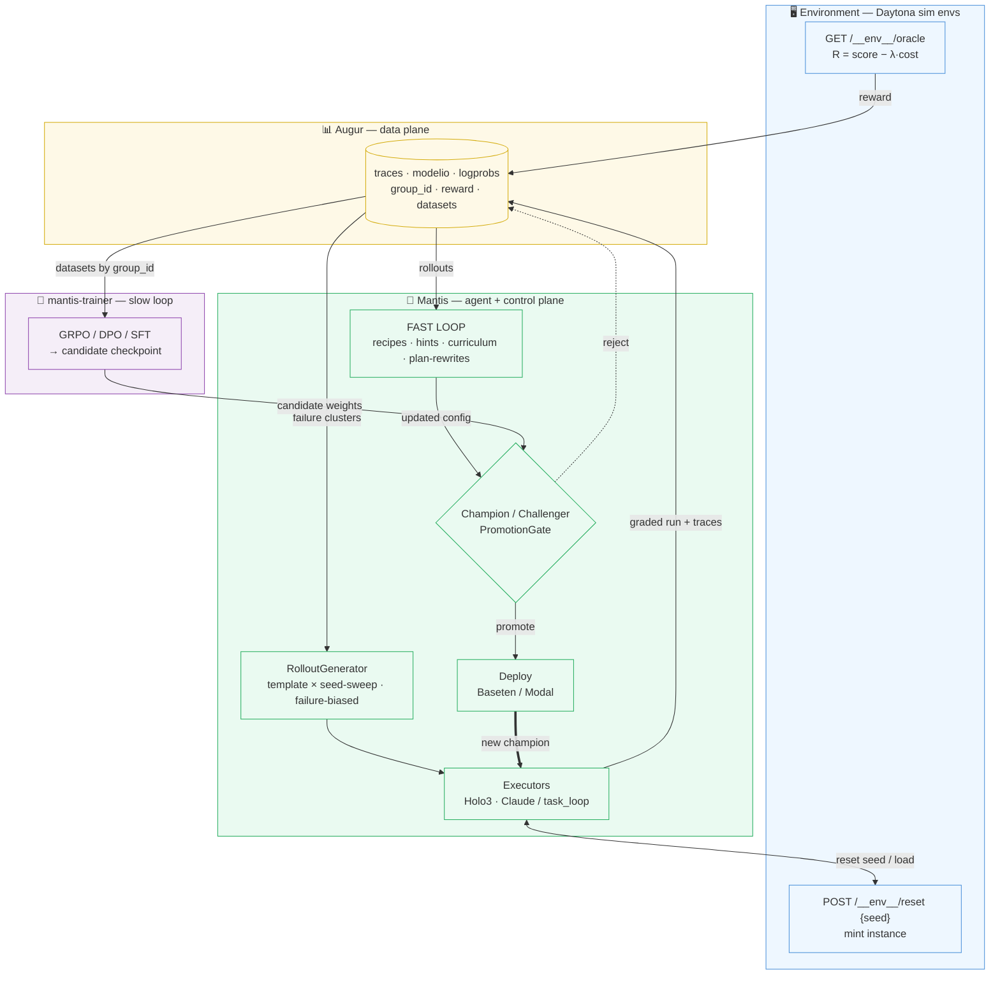
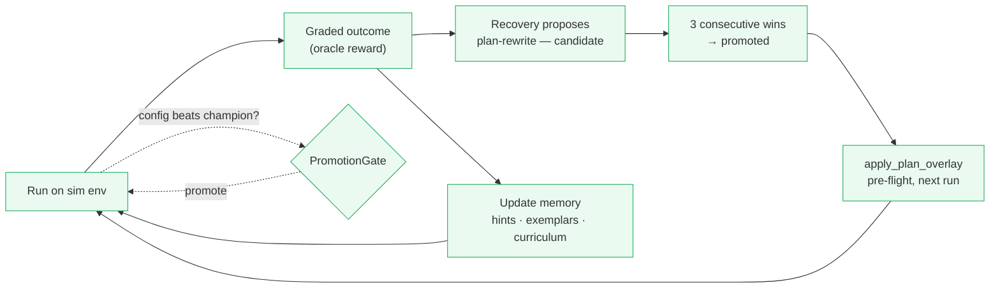
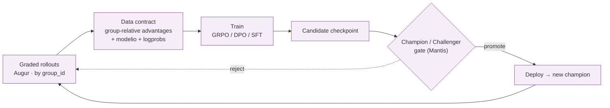

# Continuous-improvement architecture (the flywheel)

How Mantis improves itself from its own runs. This is the system-level view: the
four planes, the two improvement loops (fast / non-parametric and slow /
parametric), and the shared substrate both loops stand on.

Tracking epic: [#894](https://github.com/mercurialsolo/mantis/issues/894).

---

## 1. The idea in one line

> **Execute → observe → reward → curate → improve → evaluate → promote → repeat** — autonomously, without shipping regressions.

The agent runs tasks, every run is captured and graded, the captures become
training signal, and an improved artifact ships **only if it beats the current
champion on a frozen benchmark**. Two loops consume the same signal at different
speeds: a **fast loop** that updates memory/recipes in hours without touching
model weights, and a **slow loop** that RL-fine-tunes the brain weights over
days.

---

## 2. The four planes

| Plane | Repo | Owns | Imports |
|---|---|---|---|
| **Environment** | `mantis` (`deploy/sim_envs`) + Daytona | seed-parameterizable, oracle-graded synthetic sites | — |
| **Agent + control** | `mantis` | execution, rollout generation, fast loop, **champion/challenger gate**, controller | reads Augur |
| **Data** | `augur-sdk` | traces, `modelio`, logprobs, `group_id`, `task_spec`, reward, datasets | — |
| **Weights (slow loop)** | `mantis-trainer` | RL fine-tune (GRPO/DPO/SFT), checkpoint registry | reads Augur datasets |

**Boundary rule:** data → Augur · agent + fast loop + gate → Mantis · weights →
`mantis-trainer`. Augur is a read-only dependency for everyone; it never imports
execution or training.

---

## 3. System architecture (big picture)

Both loops feed the **same** PromotionGate; both promotions deploy the same way
and become the next champion that generates the next round of rollouts.

---

## 4. Shared substrate (both loops depend on this)

Neither loop works without these three, which is why they're built first:

1. **Rollout generation** (`mantis_agent.learning.rollout_generator`) — the
   source of diverse runs. `template × seed-sweep` (volume) +
   failure-cluster-biased selection (target weak spots). Daytona's
   `POST /__env__/reset {seed}` makes one template yield N distinct,
   oracle-graded instances → synthetic data with no human labeling.
2. **Reward** (`mantis_agent.learning.reward`) — ground-truth from the env
   oracle (`GET /__env__/oracle`, `R = score − λ·cost`); proxy LLM-judge as a
   fallback for real traffic. This is the signal both loops optimize.
3. **Champion/challenger gate** (`mantis_agent.learning.promotion_gate`) — the
   safety keystone. A challenger promotes only if it beats the champion on a
   frozen benchmark by a margin, with significance (paired bootstrap), no
   sealed-task regressions, within a cost budget.

---

## 5. The fast loop (non-parametric)

**What changes:** retrieval memory — recipes, hints, curriculum, promoted
plan-rewrites. **Not** model weights. **Cadence:** minutes–hours, CPU.
**Reversibility:** high (config/data, instantly revertible). **Where:** entirely
in `mantis`.

### How it works
1. A run hits a failure; **agentic recovery** finds a fix (e.g. a `rewrite_url`)
   and records it as a `candidate` plan-rewrite (`plan_evolution_store`).
2. `finalize_run_outcomes` scores each applied rewrite at run-terminal; after
   **3 consecutive wins** it's `promoted`.
3. On the next run, `apply_plan_overlay` applies promoted rewrites **pre-flight**
   (and, in exploration mode, candidates too — so they accumulate wins). The fix
   now compounds instead of being re-discovered each time.
4. Hints (`hint_memory`), exemplars (S0/S1 substrates), and curriculum snippets
   work the same way — captured from good runs, retrieved into future runs.
5. The `allocator` spends a budget across substrates (ε-greedy bandit), and the
   gate decides whether the improved config beats the champion before it sticks.

**Why it's first:** highest ROI, lowest risk, **no GPU** — and it produces the
trustworthy-reward + benchmark substrate the slow loop needs anyway.

---

## 6. The slow loop (parametric)

**What changes:** the **Holo3 brain weights**, via RL fine-tuning. **Cadence:**
hours–days, **GPU**. **Reversibility:** low (a worse policy) → must clear the
gate. **Where:** `mantis-trainer` (separate repo; torch/trl/vllm footprint).

### How it works
1. `mantis-trainer` pulls graded rollouts from Augur (`sources.augur`), grouped
   by `group_id` (GRPO siblings of the same task instance).
2. **Data contract** (`dataset`): map `modelio` → (prompt, completion) examples;
   compute **group-relative advantage** `A_i = (r_i − mean(r)) / (std(r) + eps)`
   per sibling group; carry per-token `logprobs` (mantis #889) for the ratio.
3. **Train** (`trainer`, GPU): GRPO objective per response token —
   `min(ρ_t·A_i, clip(ρ_t, 1±ε)·A_i) − β·KL(π_θ‖π_ref)`, `ρ_t = exp(logπ_θ − logπ_old)`.
   No value model. Emits a candidate checkpoint to the `registry`.
4. **Gate**: Mantis runs the candidate vs champion over the frozen benchmark →
   `PromotionGate` verdict.
5. **Promote**: on pass, publish weights to the model store; Baseten/Modal deploy
   it; the registry marks it champion. Rollback re-points at the prior champion.

### Serving the challenger for the gate (#911)

The gate needs the *challenger* served at `/v1/predict`. Rather than redeploy a
whole model per candidate, the CUA server serves **`base + LoRA adapter`** when a
request's suite carries `_lora_adapter` (a ref like
`mantis-trainer-vol:/checkpoints/<algo>` — the trainer's checkpoint volume is
mounted read-only on the executors). So champion and challenger are the **same
deployment**: the champion arm submits without `_lora_adapter` (base weights), the
challenger arm submits *with* it. Backend is auto-selected by base
(`mantis_agent.serving.lora_serving`):

* **llama.cpp** bases (`holo3`, the first real challenger) apply a GGUF adapter via
  `llama-server --lora`. The trainer should emit a pre-converted `.gguf` adapter so
  the serving image needs no torch/transformers (a raw PEFT dir triggers an
  in-server convert step instead).
* **vLLM** bases (`fara`/`opencua`/`evocua`) serve the PEFT dir via
  `--enable-lora`; the adapter is addressed by its served-model-name.

The gate drives both arms with `training/eval_harness.py run --lora-adapter <ref>`
(challenger) vs no flag (champion) against one endpoint. Holdout tasks carry no
plan, so `experiments/holdout/run_gate_eval.py` (#916) **generates** the
`task_suite`/`_micro_plan` per task (via `build_micro_suite`), runs both arms
(distinct `profile_id` per arm → parallel, #912), oracle-grades, and calls
`promotion_gate.evaluate` → a `GateVerdict` — the sim-env execution link between
the holdout set and the gate.

**Host parity (Modal vs Baseten).** Modal boots a fresh inference server *per
run*, so the adapter is chosen **per request** (`_lora_adapter` in the suite) and
champion + challenger share one deployment. Baseten boots **one** shared
inference server at model-load, so the adapter is fixed **per deployment** via the
`MANTIS_LORA_ADAPTER` env (`baseten_server.runtime._boot_lora_args`): the champion
deploy leaves it unset, a challenger deploy sets it (see
`deploy/baseten/holo3_challenger/config.yaml`). Either way the gate compares two
endpoints — on Modal they can be the same URL with/without the suite field; on
Baseten they're two truss deployments.

### Generating the sibling rollouts (the sweep)

`experiments/holdout/run_rollout_sweep.py` turns
[`SeedSweepGenerator`](proposals/rollout-generator.md) specs into real graded
runs: for each `(template, env_seed)` it submits N siblings sharing a `group_id`
at `temperature > 0` (so trajectories diverge → reward variance), forces Holo3
grounding (per-token logprobs), and grades each via the env oracle (#906).

Each sibling carries a **distinct** `state_key` (`sweep-<spec_id>` → its own
Chrome profile + checkpoint), so they're *independent* under the per-state-key
concurrency rule (see the [glossary](reference/glossary.md)) and fan out
in **parallel** via `--max-parallel` (default 4; `1` = sequential). The fan-out is
done by `StateKeyDispatcher` (`experiments/holdout/state_key_dispatcher.py`), a
client-side dispatcher with a per-call collision policy:

* **independent** (default) — auto-allocate a fresh unique `state_key`, run in
  parallel up to the cap. The sweep's siblings use this.
* **session** — reuse a caller-supplied `state_key` (a logged-in profile, a
  resumable checkpoint); calls on that key are queued **FIFO** (one at a time),
  while different session keys still run in parallel.

A trainer-feedback **variance gate** (`_classify_group`) then marks a group
GRPO-usable only when it has real reward spread — mixed oracle outcomes *or*
meaningful Augur `episode_return` variance from the #906 process/progress shaping
— so degenerate all-pass/all-fail groups (whose standardized advantages are
noise) are excluded or re-sampled (`--variance-seek`).

### Algorithm phasing (de-risk before full GRPO)
- **SFT** — rejection-sampling fine-tune on high-reward rollouts (no pairs, no
  logprobs). Proves the data→checkpoint→gate→deploy pipe.
- **DPO** — `(chosen, rejected)` preference pairs from each `group_id`.
- **GRPO** — full group-relative PG; needs the logprobs from #889.

**Why it's last:** the trainer is only as good as its reward. Build the reward +
gate first; every checkpoint ships only through the same gate as any other
challenger.

---

## 7. Fast vs slow — side by side

| | **Fast loop** | **Slow loop** |
|---|---|---|
| Artifact changed | recipes / hints / curriculum / plan-rewrites | Holo3 **weights** |
| Mechanism | retrieval / overlay | RL fine-tune (GRPO/DPO/SFT) |
| Compute | CPU | **GPU** |
| Cadence | minutes–hours | hours–days |
| Repo | `mantis` | `mantis-trainer` |
| Data needed | oracle reward | reward + `modelio` + `group_id` + logprobs |
| Reversibility | high (config) | low (weights) → gate-gated |
| Ceiling | bounded by base model's capability | raises the base model's capability |
| Risk | low | high → champion/challenger mandatory |

They are complementary, not alternatives: the fast loop squeezes the most out of
the current weights *today*; the slow loop raises the ceiling those weights
allow. Both gate through the same safety check and deploy the same way.

---

## 8. Lifecycle of one improvement (end to end)

**Fast:** failing run → recovery proposes a rewrite → 3 wins → promoted →
auto-applied next run → gate confirms the config beats champion → sticks. *Hours.*

**Slow:** rollout generator mints N seed-varied instances → executed + oracle-graded
→ Augur dataset → trainer computes advantages + GRPO step → candidate checkpoint →
gate runs it vs champion on the frozen benchmark → promote → deploy → new champion
generates the next rollouts. *Days.*

---

## 9. Status

| Component | State |
|---|---|
| Execution (Holo3 + Claude/task_loop), Augur instrumentation | ✅ on main |
| Rollout generator primitives (seed-sweep, failure-biased) | ✅ on main |
| Closed plan-evolution fast loop (`apply_plan_overlay` wired) | ✅ on main |
| Champion/challenger gate | ✅ on main |
| Serve `base + LoRA adapter` challenger at `/v1/predict` (#911) | ✅ on main + deployed (GPU run deploy-gated) |
| Holdout-eval runner — generate sim-env suites + gate vs `/v1/predict` (#916) | ✅ on main (`experiments/holdout/run_gate_eval.py`; live run spend-gated) |
| Logprob capture (GRPO prerequisite, #889) | ✅ on main |
| `RolloutRunner` execution adapter (generator → Daytona → Augur) | ⏳ P1 (#894) |
| `mantis-trainer` data contract | ✅ scaffold + dataset implemented |
| `mantis-trainer` GPU trainer (GRPO) | ⏳ P2 (separate repo) |

See [`mantis-trainer/docs/SPEC.md`](https://github.com/mercurialsolo/mantis-trainer)
for the slow-loop detail and the rollout-generator proposal under
`docs/proposals/` for the data-generation engine.
