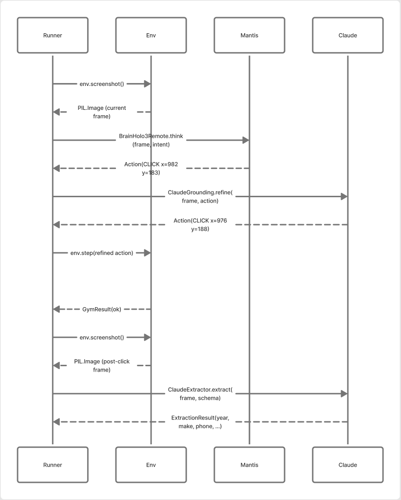

# Integration: vision_claude → Mantis (Path C, orchestrated)

How vision_claude consumes Mantis without giving up the Xvfb + mounted-browser
desktop it owns today. Side-by-side architecture, sequence flow, deployment
topology, and migration cost.

> **For the host-agnostic API reference** (what to import, the four
> integration knobs, backwards-compat invariants), see
> [`integrations/embedding-microplanrunner.md`](./integrations/embedding-microplanrunner.md).
> This doc is the vision_claude-specific narrative; the embedding doc is
> what every host integration ends up consulting.

---

## A. Today — vision_claude with Claude CUA (in-process)

Detailed view of what runs in production today. `agent_loop.py` calls Anthropic Computer Use, the tool dispatch covers `computer_tool` / `bash_tool` / `edit_tool` / `user_input_tool` / `correspondent_message_tool`, and the desktop stack is Xvfb → Chrome → mounted EFS profile. `ExecutionObserver` handles pause / resume / OTP flows.


[Edit in FigJam](https://www.figma.com/board/1MoQ7KJVM0a5GJQCWUTYpH)

**Cost shape:** every screen pixel goes to Anthropic. Claude reasons through the whole plan ("login → find lead → edit industry"). Pricey per task, but reliable on multi-step plans because Claude has the reasoning depth.

---

## B. Path C — orchestrated Mantis (browser stays in vision_claude)


[Edit in FigJam](https://www.figma.com/board/zp00qbT3Be58laMFlHWomA)

The skeleton matches the current-state diagram one-for-one — the same caller, server, handler, observer, desktop, Xvfb, Chrome, profile, and site sit in the same positions. **Green** highlights what's new or changed in Path C: `MantisOrchestratedBackend`, `MicroPlanRunner`, the three brain/Claude workers, the `VisionClaudeGymEnv` adapter, and the Mantis Holo3 service.

**Cost shape:** Holo3 (cheap GPU) does click/scroll/type. Claude does only
gate-verify + structured extraction + click grounding. Browser stays in
vision_claude, so the mounted profile and pause/resume machinery are
untouched.

---

## C. One micro-step — sequence diagram



[Edit in FigJam](https://www.figma.com/board/RDnyMSecbwTtu7W7CEdnZs)

Note the screenshot bytes flow:
- **Holo3 path:** screenshot bytes → Mantis service (own Baseten/EKS).
  Image leaves vision_claude only to your own deployment.
- **Claude path:** screenshot bytes → Anthropic. Same as today.
- **Mantis service never sees** the Anthropic key, the StaffAI cookies,
  the EFS profile, or any per-tenant secrets.

---

## D. Reliability comparison

| Workflow | Claude-only CUA today           | Path C (Mantis orchestrated)                |
|----------|---------------------------------|---------------------------------------------|
| 1-step task ("logout") | ✅ very reliable      | ✅ reliable (single click step)              |
| Multi-step ("login → filter → export") | ✅ Claude reasons through | ✅ MicroPlanRunner enforces section+gate semantics |
| Form-heavy ("update 12 fields, submit")| ⚠️ drift on long context | ✅ each field is its own claude_only extract step |
| Pagination loop                | ⚠️ Claude can lose count    | ✅ explicit `loop_count` + `paginate` step types |
| OTP / human-in-the-loop pause  | ✅ first-class               | ✅ unchanged — loop is local, pause hooks intact |

The reliability win is the **structured plan + per-step verification**, not
the model. Holo3 alone fails on multi-step plans; Holo3 inside MicroPlanRunner
matches Claude's success rate at a fraction of the cost.

---

## E. Deployment topology

```
                  ┌────────────────────────────────────────────────┐
                  │  AWS account (or GCP project)                  │
                  │                                                │
                  │  ┌──────────────────────────────────────────┐  │
                  │  │  vision_claude task                      │  │
                  │  │  • c6i.2xlarge (no GPU)                  │  │
                  │  │  • Xvfb + Chrome + persisted profile     │  │
                  │  │  • runs MicroPlanRunner in-process       │  │
                  │  │  • per-tenant isolation                  │  │
                  │  └──────────────┬───────────────────────────┘  │
                  │                 │ HTTPS                         │
                  │                 ▼                               │
                  │  ┌──────────────────────────────────────────┐  │
                  │  │  Mantis Holo3 service                    │  │
                  │  │  • Baseten H100  (already deployed)      │  │
                  │  │  • OR EKS g6e.2xlarge / GKE a2-highgpu   │  │
                  │  │  • autoscale 0..N                        │  │
                  │  │  • shared across tenants                 │  │
                  │  │  • only sees screenshot bytes            │  │
                  │  └──────────────────────────────────────────┘  │
                  │                                                │
                  └────────────────────────────────────────────────┘

                                 │ HTTPS
                                 ▼
                       Anthropic API (gates, extract, grounding)
```

**vision_claude task scales per tenant** (or per concurrent session).
**Mantis Holo3 scales by inference throughput** — one shared deployment
serves all tenants. GPU cost amortizes across customers.

---

## F. Concrete integration — code on the vision_claude side

Now that the cua-agent server exposes `/v1/chat/completions` (auth-gated proxy to in-pod Holo3) the vision_claude integration is small. Two new modules + one rewrite of the existing `mantis_backend.py`:

### F.1 `vision_claude/vision_claude_gym_env.py` (new, ~120 LoC)

```python
"""Adapter that lets mantis_agent.MicroPlanRunner drive vision_claude's
existing Xvfb desktop. Implements GymEnvironment over desktop.py +
computer_tool.py. Browser stays in vision_claude — only screenshots and
xdotool actions cross the in-process boundary."""

from PIL import Image
from mantis_agent.actions import Action, ActionType
from mantis_agent.gym.base import GymEnvironment, GymObservation, GymResult

from .desktop import Desktop  # existing vision_claude module
from .computer_tool import ComputerTool  # existing


class VisionClaudeGymEnv(GymEnvironment):
    def __init__(self, desktop: Desktop, computer_tool: ComputerTool):
        self._desktop = desktop
        self._computer = computer_tool
        self._w, self._h = desktop.viewport_size  # (1280, 720) default

    @property
    def screen_size(self) -> tuple[int, int]:
        return (self._w, self._h)

    def screenshot(self) -> Image.Image:
        return self._desktop.screenshot()

    def reset(self, task: str, **kwargs) -> GymObservation:
        start_url = kwargs.get("start_url")
        if start_url:
            self._desktop.navigate(start_url)
        return GymObservation(screenshot=self.screenshot())

    def step(self, action: Action) -> GymResult:
        # Mantis Action -> vision_claude ComputerTool dispatch
        params = action.params or {}
        if action.action_type == ActionType.CLICK:
            self._computer.click(params["x"], params["y"], button=params.get("button", "left"))
        elif action.action_type == ActionType.TYPE:
            self._computer.type_text(params["text"])
        elif action.action_type == ActionType.KEY_PRESS:
            self._computer.key_combo(params["keys"])
        elif action.action_type == ActionType.SCROLL:
            self._computer.scroll(params.get("direction", "down"), params.get("amount", 5))
        elif action.action_type == ActionType.NAVIGATE:
            self._desktop.navigate(params["url"])
        elif action.action_type == ActionType.DONE:
            return GymResult(GymObservation(screenshot=self.screenshot()), 1.0, True, {})
        return GymResult(GymObservation(screenshot=self.screenshot()), 0.0, False, {})

    def close(self) -> None:
        pass  # Desktop lifecycle owned by vision_claude
```

### F.2 `vision_claude/mantis_backend.py` rewrite (~80 LoC change)

```python
"""MantisOrchestratedBackend — runs MicroPlanRunner locally, calls Mantis
Holo3 inference + Anthropic only. Drop-in for ClaudeCUABackend behind
VISION_CLAUDE_CUA_BACKEND=mantis-orchestrated."""

import json
from collections.abc import Callable
from typing import Any

from mantis_agent.brain_holo3 import BrainHolo3
from mantis_agent.extraction import ClaudeExtractor
from mantis_agent.grounding import ClaudeGrounding
from mantis_agent.gym.micro_runner import MicroPlanRunner
from mantis_agent.plan_decomposer import MicroPlan, PlanDecomposer

from .cua_backend import CUABackend, CUALoopResult
from .desktop import Desktop
from .computer_tool import ComputerTool
from .settings import VisionClaudeSettings
from .vision_claude_gym_env import VisionClaudeGymEnv


class MantisOrchestratedBackend(CUABackend):
    def __init__(self, *, settings: VisionClaudeSettings,
                 desktop: Desktop, computer_tool: ComputerTool) -> None:
        self._s = settings
        self._env = VisionClaudeGymEnv(desktop, computer_tool)

    async def run_loop(self, *, messages, max_iterations=100, **kwargs) -> CUALoopResult:
        prompt = self._extract_prompt(messages)

        # Holo3 inference goes to OUR Mantis service via /v1/chat/completions.
        # Two host-neutral knobs:
        #   - mantis_endpoint: where the deployment lives (Baseten/Modal/EKS/GKE — vision_claude
        #     doesn't care which).
        #   - mantis_api_token: the container-level X-Mantis-Token. Always required.
        # Optional third knob — mantis_gateway_authorization — is only needed when an upstream
        # gateway (e.g. Baseten) sits in front of the container and demands its own Authorization
        # header. Self-hosted Modal/EKS/GKE deployments leave it empty.
        headers: dict[str, str] = {"X-Mantis-Token": self._s.mantis_api_token}
        if self._s.mantis_gateway_authorization:
            headers["Authorization"] = self._s.mantis_gateway_authorization
        brain = BrainHolo3(
            base_url=f"{self._s.mantis_endpoint}/v1",
            extra_headers=headers,
            timeout=180,
        )
        # Claude helpers go DIRECT to Anthropic (vision_claude already has the key)
        extractor = ClaudeExtractor(api_key=self._s.anthropic_api_key)
        grounding = ClaudeGrounding(api_key=self._s.anthropic_api_key)

        plan = self._build_plan(prompt, kwargs)
        runner = MicroPlanRunner(
            brain=brain,
            env=self._env,
            grounding=grounding,
            extractor=extractor,
            session_name=kwargs.get("session_name", "vision_claude"),
            max_cost=kwargs.get("max_cost", 5.0),
            max_time_minutes=kwargs.get("max_time_minutes", 30),
        )
        result = runner.run_with_status(plan)  # RunnerResult dataclass
        # The runner doesn't surface a single "final text" the way Claude does
        # (it's a step-by-step plan, not a free-form chat). Synthesize one from
        # the last successful extraction step's data, falling back to a step
        # count summary. Customize as needed.
        last_data = next(
            (s.data for s in reversed(result.steps) if s.success and s.data),
            f"Plan complete: {len(result.steps)} steps executed",
        )
        return CUALoopResult(
            messages=messages,
            final_text=last_data,
            tool_calls_count=sum(r.steps_used or 0 for r in result.steps),
            execution_trace=self._trace(result.steps),
            shutdown_requested=result.cancelled,  # #76 wiring
            # pause_request would be populated from result.pause_state when paused (#73)
        )

    def _build_plan(self, prompt: str, kw: dict[str, Any]) -> MicroPlan:
        # If caller hands us a structured plan, use it. Otherwise decompose.
        if "micro_plan" in kw:
            return MicroPlan.from_dict(kw["micro_plan"])
        return PlanDecomposer().decompose(prompt)

    @staticmethod
    def _extract_prompt(messages: list[dict[str, Any]]) -> str:
        for m in reversed(messages):
            if m.get("role") == "user":
                c = m.get("content", "")
                if isinstance(c, str):
                    return c
                for block in c if isinstance(c, list) else []:
                    if isinstance(block, dict) and block.get("type") == "text":
                        return block.get("text", "")
        return ""

    @staticmethod
    def _trace(results) -> list[dict[str, Any]]:
        return [
            {"tool_calls": [{
                "tool": r.intent[:30],
                "result": "success" if r.success else "failed",
            }]}
            for r in results
        ]
```

### F.3 `vision_claude/settings.py` — three host-neutral fields

vision_claude does not need to know whether the Mantis service is hosted
on Baseten, Modal, EKS, or GKE. The contract is just: a URL, a container
auth token, and (optionally) an upstream gateway header.

```python
mantis_endpoint: str = Field(
    default="",
    description=(
        "Base URL of the Mantis service (without /v1 suffix). "
        "Same shape regardless of host — Baseten gateway URL, Modal web "
        "endpoint, or your own ingress. "
        "On Baseten, append `/sync` to the model URL so the gateway "
        "forwards /v1/chat/completions to the container — e.g. "
        "https://model-qvvgkneq.api.baseten.co/production/sync. "
        "Modal/EKS/GKE deployments expose the FastAPI app directly with "
        "no /sync prefix."
    ),
)
mantis_api_token: SecretStr = Field(
    default=SecretStr(""),
    description=(
        "X-Mantis-Token for the Mantis container. Always required. "
        "Mirrors the value of the container's MANTIS_API_TOKEN secret."
    ),
)
mantis_gateway_authorization: SecretStr | None = Field(
    default=None,
    description=(
        "Optional Authorization header value for an upstream gateway. "
        "Sent verbatim, e.g. 'Api-Key abc123' on Baseten. Leave empty "
        "for Modal / EKS / GKE direct deployments that have no gateway."
    ),
)
```

The two-or-three field split keeps the per-host secret naming inside the
*deployment*'s configuration. Switching from Baseten to Modal swaps the
endpoint and clears `mantis_gateway_authorization`; the staffai callsite
doesn't change.

### F.4 `vision_claude/backend_factory.py` — register the new backend

```python
def make_backend(settings: VisionClaudeSettings, **kw) -> CUABackend:
    backend = settings.cua_backend or "claude"
    if backend == "claude":
        return ClaudeCUABackend(settings=settings)
    if backend == "mantis-orchestrated":
        return MantisOrchestratedBackend(settings=settings, **kw)
    raise ValueError(f"unknown CUA backend: {backend}")
```

### F.5 What blocks adoption (post-PR)

| Blocker | Resolution |
|---------|------------|
| `mantis_agent` import drags GPU deps via package `__init__` | Tier 1.5 follow-up: `[orchestrator]` extras in pyproject. Until then, tolerate the ~30MB image bloat. |
| `BrainHolo3` constructor `extra_headers` parameter | Already supported. No change needed. |
| `VisionClaudeGymEnv` doesn't exist yet | F.1 above — this is the bulk of the integration. |
| Plan input — vision_claude callers send Claude messages today | F.2 falls back to `PlanDecomposer().decompose(prompt)` for plain text. Hand-author micro-plans for high-volume StaffAI workflows; auto-decompose for one-shots. |

Total work to ship in vision_claude: ~260 LoC + ~50 LoC tests. The
`mantis-agent` library now installs cleanly thanks to PR #62 (the
`modal_runtime` extraction means GPU deps aren't dragged at import time
for orchestrator-only use).

---

## G. Migration phases

```
Phase 1 — cua-agent ships
  ├─ /v1/chat/completions proxy on Baseten endpoint
  ├─ BrainHolo3Remote (auth-aware client)
  ├─ [orchestrator] extras
  └─ docs/integration-vision_claude.md  ← this file

Phase 2 — vision_claude integrates (canary)
  ├─ VisionClaudeGymEnv
  ├─ MantisOrchestratedBackend
  ├─ env-flag gate: VISION_CLAUDE_CUA_BACKEND=mantis-orchestrated
  └─ canary on one tenant / one workflow

Phase 3 — fleet rollout
  ├─ tenant-by-tenant flip
  ├─ track {success_rate, latency, cost_per_task} vs Claude baseline
  └─ default-flip when 30-day metrics match-or-beat

Phase 4 — decommission
  ├─ remove ClaudeCUABackend if no fallback callers
  ├─ drop GPU-backed vision_claude task spec
  └─ retire agent_loop.py + Anthropic Computer Use plumbing
```

Each phase is independently revertable — env-var flip restores Claude
backend with zero data migration.
